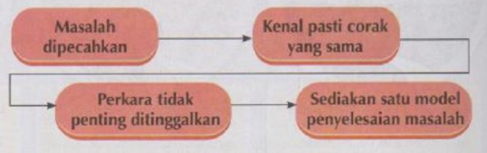
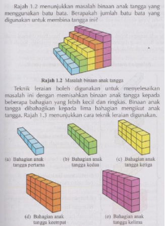
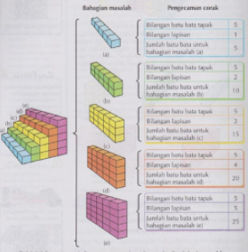
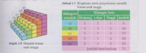

# Konsep Asas Pemikiran Komputasional

---

**_Pemikiran komputasional_** pemikiran ialah **suatu proses pemikiran bagi menyelesaikan masalah** oleh manusia sendiri yang dibantu oleh mesin atau kedua-duanya sekali dengan menggunakan konsep asas sains komputer. 
Terdapat 4 teknik yang akan kita belajar semsa tingkatan 1, 2 dan 3.

---

### Teknik Leraian _(decomposition)_

**Pemecahan suatu masalah** atau sistem yang kompleks kepada bahagian-bahagian yang lebih kecil. Dengan ini, kits dapat kita **memahami sesuatu proses kerja dengan lebih mudah**.

---

### Teknik Pengecaman Corak _(pattern recognition)_

**Pengenalpastian persamaan** dalam pelbagai masalah atau masalah yang sama. Teknik ini mombolehkan kita menghasilkan satu idea yang boleh digunakan untuk menyelesaikan masalah lain yang mempunyai persamaan.

---

### Teknik Peniskalaan _(abstraction)_

**Pengutamaan aspek-aspek yang penting** dalam suatu masalah dan **meninggalkan masalah yang kurang penting**. Dengan ini, kita **dapat mengenal pasti faktor-faktor yang akan mempengaruhi hasil atau output yang diperlukan**.

---
### Teknik Pengitlakan _(generalisation)_

**Pembinaan model** berdasarkan corak-corak yang telah dikenal pasti daripada beberapa masalah yang serupa. Model boleh dibina dalam bentuk **formula**, **teknik**, **peraturan** dan **langkah-langkah**.