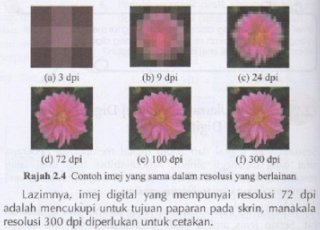
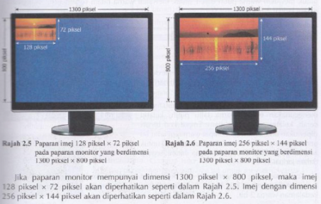
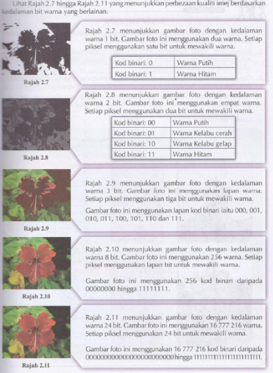
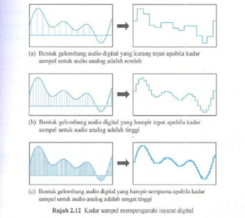
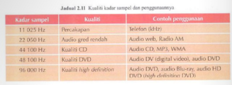
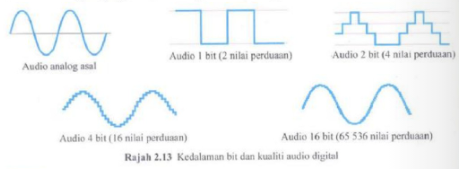
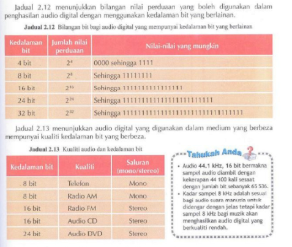
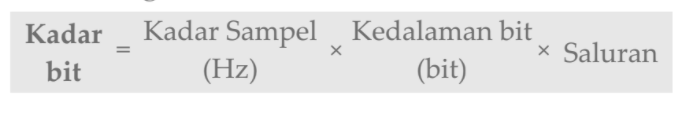
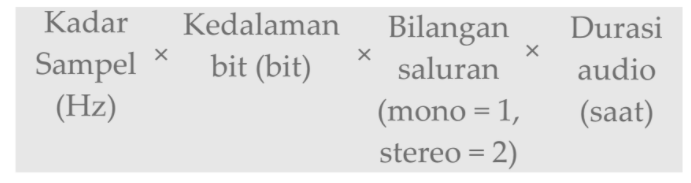

Terdapat beberapa sistem nombor yang sering digunakan dalam pembangunan aturcara seperti:
- sistem nombor perduaan (sistem **binari**)
- sistem nombor perlapanan (sistem **oktal**)
- sistem nombor perpuluhan (sistem **desimal**)
- sistem nombor perenambelasan (sistem **hexadesimal**)

---

### Sistem Nombor Perduaan 
- dikenali sebagai **sistem asas 2** atau **sistem nombor binari** _(binary number system)_
- menggunakan **0 dan 1** untuk mewakili data
- Nilai sesuatu digit dalam sistem perduaan bergantung kepada nilai tempatnya dalam nombor yang berkenaan

---

### Sistem Nombor Perlapanan
- dikenali sebagai **sistem asas 8** atau **sistem nombor oktal** _(octal number system)_
- mempunyai lapan digit pilihan digit daripada **0 hingga 7**
- nombor perduaan yang lebih panjang dapat diwakili dengan nombor perlapanan yang lebih pendek dan kemas

---

### Sistem Nombor Perpuluhan
- dikenali sebagai **sistem asas 10** atau **sistem desimal** _(decimal number system)_
- mempunyai sepuluh pilihan digit, iaitu daripada **0 hingga 9**.
- Nilai sesuatu digit dalam sistem perpuluhan dikira dengan mendarabkannya dengan nilai tempatnya.

---

### Sistem Nombor Perenambelasan
- dikenali sebagai **sistem asas 16** atau **sistem nombor heksadesimal** _(hexadecimal number system)_
- menggunakan sepuluh digit dan enam abjad, iaitu **0, 1, 2, 3, 4, 5, 6, 7, 8, 9, A, B, C, D, E** dan **F**
- menggunakan untuk **mewakili warna pada alatan digital dalam model warna RGB**
- menyimpan data dengan lebih cekap dan efisien

---

### Ukuran data
- **Imej digital** ialah gambar yang dirakam dan disimpan dalam bentuk pola-pola bit (0 dan 1).
- **Audio digital** ialah isyarat bunyi yang telah ditukar kepada nombor perduaan dan disimpan dalam bentuk pola-pola bit. 

#### Unit ukuran bagi imej digital
Ukuran bagi imej digital mempunyai **tiga** jenis iaitu:

- **Resolusi** sesuatu imej merujuk kepada **bilangan piksel yang terdapat pada imej** tersebut. Unitnya ialah _dpi_ _(dots per inch)_.


- **Dimensi** sesuatu imej ialah **ukuran panjang dan lebar imej** dalam unit piksel. Dimensi biasanya dinyatakan dalam bentuk **bilangan piksel panjang darab bilangan piksel lebar**.


- **Kedalaman bit warna** ialah **bilangan bit 0 dan 1 yang digunakan untuk menandakan satu warna yang tertentu dalam sesuatu imej** digital.Lebih banyak bit yang digunakan, maka **lebih tinggi** kedalaman bit warna, **lebih berkualiti** imej tersebut.


#### Unit Ukuran bagi Audio Digital
- **Kadar sampel** ialah **bilangan sampel sesaat yang diambil oleh alat _ADC_ _(Analog-to-Digital Converter)_ semasa melakukan pendigitalan sesuatu audio analog**. Unitnya ialah **_Hertz_ _(Hz)_**.


- **Kedalaman bit** ialah **bilangan bit (0 dan 1) yang digunakan untuk mewakili aras rakaman setiap sampel audio** Unitnya **_bit per sampel_**.



### Perkaitan Saiz Fail Imej dengan Format Fail
Empat contoh fail imej yang sering digunakan dalam Internet:
- _Joint Photographic Experts Groups (JPEG)_
- _Graphics Interchange Format (GIF)_ 
- _Bitmap (BMP)_
- _Tagged Image File Format (TIFF)_

### Perkaitan antara Kualiti, Saiz, Kedalaman Warna _(colour depth)_ dan Resolusi Imej
Kualiti dan saiz imej dipengaruhi oleh kedalaman warna, resolusi dan dimensi imej. **Lebih tinggi resolusi, dimensi dan kedalaman bit warna maka lebih tinggi keperincian sesuatu imej dan memberikan imej yang jelas, tajam dan menarik.**

Lebih tinggi resolusi dan dimensi, lebih banyak piksel digunakan untuk membentuk imej. Lebih banyak piksel bermakna lebih banyak bit dan bait diperlukan untuk menyimpan maklumat tentang piksel-piksel dalam imej dan menyebabkan saiz imej besar. 

Lebih tinggi kedalaman bit warna sesuatu imej, semakin tinggi piksel per bit (ppb) imej. Lebih banyak bit dan bait diperlukan untuk menyimpan maklumat piksel imej dan menjadikan saiz imej besar.

### Perhubungan antara Saiz Audio dengan Kadar Kedalaman Bit _(bit depth)_
Kadar kedalaman bit menunjukkan jumlah bilangan bit yang diproseskan bagi setiap saat audio itu dimain balik. Kebiasaannya kadar kedalaman bit diukur dalam **_bit per saat (bps)_**.

Cara mengukur kadar kedalaman bit:

Terdapat dua jenis saluran audio iaitu:
1. **Audio mono** 
2. **Audio stereo**

Audio mono dikeluarkan melalui **satu saluran** manakala audio stereo dikeluarkan melalui **dua saluran** audio.

### Saiz Fail dan Kualiti untuk Audio yang Sama dalam Pelbagai Format Fail
Format-format fail audio menggunakan teknik yang berbeza untuk menyimpan data audio. Teknik yang diguna untuk pemampatan akan mempengaruhi kualiti audio dan saiz fail audio.

Antara jenis-jenis fail audio ialah:
1. **_Waveform Audio File Format (WAVE / WAV)_**
2. **_MPEG Layer III (MP3)_**
3. **_Musical Instrument Digital Interface (MIDI)_**

### Penukaran Saiz Data dari Bit ke Bait, Kilobait,Megabait,Gigabait dan Terabait bagi Fail Audio dan Imej
Unit data terkecil bagi komputer ialah **bit**. Unit storan data ialah **bit**, **bait**, **kilobait (KB)**, **megabait (MB)**, **gigabait (GB)** dan **terabait (TB)**.
```
1 bait = 1 bit
1 kilobit = 1024 bit
1 megabit = 1024 bit
1 gigabit = 1024 bit
1 terabit = 1024 bit
```

Saiz fail audio digital boleh dikira dengan cara:
