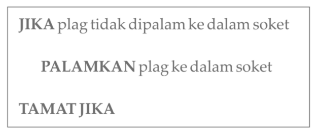
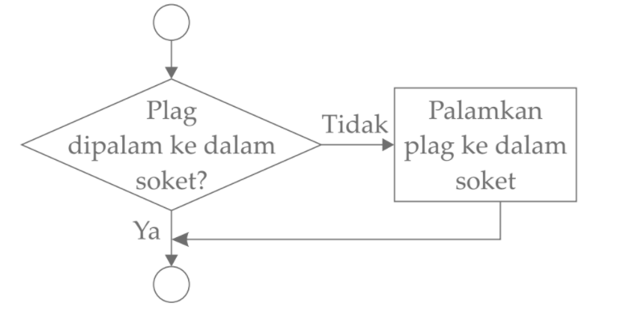
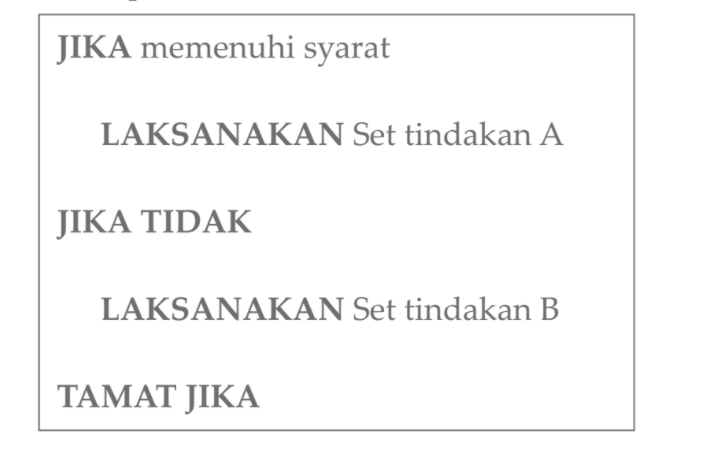
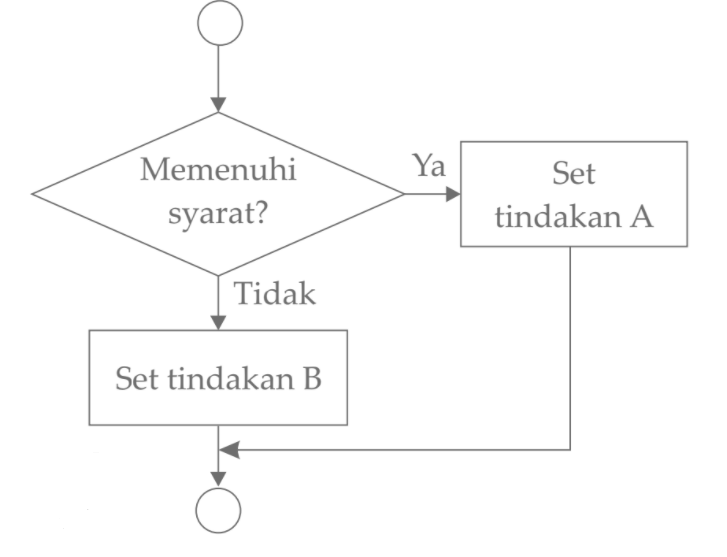
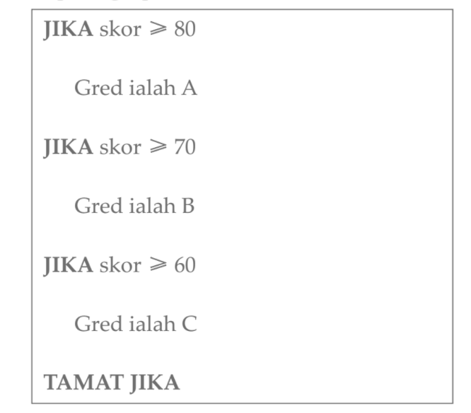
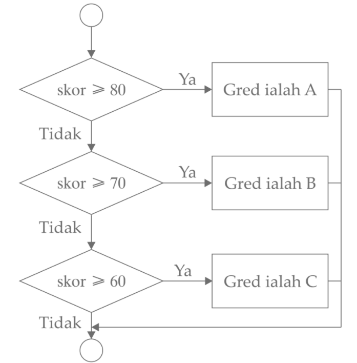

Algoritma bermaksud **tatacara yang menyatakan tindakan-tindakan** yang perlu dilaksanakan dan urutan tindakan untuk menyelesaikan sesuatu masalah.

Algoritma diwakilkan melalui pelbagai cara, khususnya:
- pseudokod 
- carta alir

---
 
### Pseudokod
- Pseudokod memerihalkan langkah-langkah algoritma dengan menggunakan **ayat-ayat yang ringkas dan padat**.

### Carta Alir
- Carta Alir menggunakan **simbol grafik seperti garis lurus, anak panah, dan bentuk geometri** untuk mewakili urutan langkah bagi algoritma yang perlu dilaksanakan.

---

### Struktur kawalan pilihan dan ulangan
- **Struktur kawalan pilihan tunggal _(single selection)_**
- **Struktur kawalan dwipilihan _(double selection)_**
- **Struktur kawalan pelbagai pilihan _(multi selection)_**
- **Struktur kawalan ulangan Untuk _(FOR)_**
- **Struktur kawalan ulangan Selagi _(WHILE)_**
- **Struktur kawalan Ulang-sehingga _(REPEAT-UNTIL)_**

---

####  Struktur kawalan pilihan tunggal _(single selection)_
- Hanya mempunyai satu pilihan untuk melaksanakan satu set tindakan yang tertentu.
- Contoh pseudokod bagi struktur kawalan pilihan tunggal:

- Carta alir bagi pseudokod di atas:

---

#### Struktur kawalan dwipilihan _(double selection)_
- Memilih antara dua tindakan atau dua set tindakan untuk dilaksanakan.
- Contoh pseudokod bagi struktur kawalan dwipilihan:

- Carta alir bagi pseudokod di atas:

---

#### Struktur kawalan pelbagai pilihan _(multi selection)_
- Mengandungi lebih daripada dua set tindakan yang berlainan sebagai pilihan untuk dilaksanakan.
- Contoh pseudokod bagi struktur kawalan pelbagai pilihan :

- Carta alir bagi pseudokod di atas:

---

#### Struktur kawalan ulangan Untuk _(FOR)_
- melaksanakan satu langkah atau satu set langkah berdasarkan pembilangan yang telah ditetapkan.

---

#### Struktur kawalan ulangan Selagi _(WHILE)_
- akan melaksanakan satu langkah atau satu set langkah selagi satu syarat yang diuji adalah benar.

---

#### Struktur kawalan Ulang-sehingga(REPEAT-UNTIL)
- akan melaksanakan satu langkah atau satu set langkah secara berulang-ulang sehingga syarat yang diuji adalah benar.

---
 
### Pengesanan Ralat yang Terdapat dalam Pseudokod dan Carta Alir
Jenis ralat yang biasa dijumpai ialah **ralat logik**, iaitu ralat yang menyebabkan sesuatu algoritma **tidak menghasilkan output yang diingini**. Ralat logik terjadi apabila **tindakan atau langkah-langkah yang salah diminta untuk dilaksanakan** atau **urutan pelaksanaan tindakan tidak betul**.

Teknik semakan ralat semula yang boleh dilakukan untuk menyahpepijat ialah:
- **Teknik semakan meja _(Desk Check)_** ialah teknik di mana penyemak **menggunakan satu sampel data input** dan memproses data secara manual mengikut langkah algoritma. **Output yang diperoleh dibandingkan dengan output yang dijangka**.
- **Teknik langkah demi langkah _(Step Through)_** ialah teknik **memeriksa logik algoritma secara langkah demi langkah** mengikut urutan dalam algoritma.

Teknik semakan semula juga dikenali sebagai **semakan kualiti _(Quality Check)_**.

---

### Penghasilan Pseudokod dan Carta Alir bagi Algoritma yang Melibatkan Gabungan Pelbagai Pilihan dan Ulangan
Langkah-langkah menghasilkan pseudokod dan carta alir bagi sesuatu algoritma ialah:
1. Mengenal pasti masalah
2. Menentukan data yang perlu digunakan
3. Menentukan proses atau tugas yang perlu dilaksanakan
4. Menentukan output yang diingini
5. Mereka bentuk algoritma
6. Menulis pseudokod dan melukis carta alir bagi sesuatu algoritma

