**Kod arahan** merupakan **satu arahan yang mengarahkan komputer melakukan sesuatu tugas**. Contoh bahasa pengaturcaraan yang digunakan adalah seperti **Visual Basic** , **JAVA** , **Visual C++** , **Python** dan lain-lain.

---

**Pemboleh ubah** ialah **storan ingatan** yang digunakan oleh program komputer untuk menyimpan data yang perlu diolahkan kemudian.

---

**Operator matematik** ialah simbol-simbol seperti tambah(+), tolak(-), darab(x) dan bahagi(÷)
yang digunakan dalam menjalankan operasi matematik dalam kod arahan.

---

### Struktur Kawalan Pilihan
```
IF = pilihan tunggal
IF...ELSE = dwipilihan
IF...ELSE IF...ELSE = pelbagai pilihan
```

---

### _Scratch 2.0_
_Scratch_ merupakan satu **bahasa pengaturcaraan berbasis visual yang interaktif dan menarik**.

Dalam atur cara _Scratch 2.0_, blok-blok yang digunakan untuk struktur ulangan ialah:
- forever


- repeat

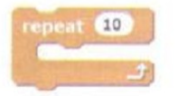
- repeat-until

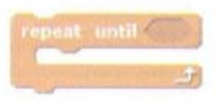

---

### Pembangunan atur cara
Pembangunan atur cara melibatkan 5 fasa iaitu:
1. **Analisis masalah**
2. **Reka bentuk program**
3. **Pengekodan**
4. **Pengujian dan penyahpepijatan**
5. **Dokumentasi**.

---

#### Analisis masalah
Pengatur cara perlu **mengetahui kehendak pelanggan** untuk menentukan input, proses dan output bagi atur cara yang hendak dibangunkan

---

#### Reka Bentuk Program
Pengatur cara mula **menulis pseudokod, melakar carta alir dan mereka bentuk Antara Muka Pengguna Grafik _(Grapical User Interface, GUI)_**

---

#### Pengekodan
**Pseudokod akan ditukarkan kepada kod yang difahami oleh komputer** dengan menggunakan bahasa pengaturcaraan seperti _Visual Basic_, _Java_ ataupun _Visual C++_.

---

#### Pengujian dan penyahpepijatan
Atur cara yang ditulis akan diuji untuk **mengesan dan membetulkan sebarang ralat** yang terdapat pada atur cara.

---

#### Dokumentasi
Proses menghasilkan **laporan proses pembangunan** peringkat awal hingga akhir proses. Terdapat dua jenis dokumentasi iaitu **dokumentasi dalaman** (untuk kegunaan pelanggan) dan **dokumentasi luaran** (untuk pengguna akhir yang menggunakan atur cara).

---

#### Ralat
Ralat yang terdapat dalam atur cara akan menyebabkan atur cara tidak dapat beroperasi dengan betul,terdapat **3 jenis ralat** iaitu:

###### Ralat Sintaks
Berlaku semasa proses menulis kod arahan tidak mengikut sintaks bahasa pengaturcaraan sehingga tidak dapat difamahi oleh komputer.

Contoh: menaip alamat e-mel sebagai **"dotcom"** dan bukan **".com"**

###### Ralat Masa Larian
Berlaku semasa sesuatu program sedang dilancarkan disebabkan oleh program dan bukan sistem operasi. 

Contoh: **perisian hasad _(malicious software)_** seperti **virus** atau **cecacing**, **kepincangan atur cara _(program flaw)_**, **pepijat _(bug)_** dan **ingatan yang tidak mencukupi _(insufficient memory)_**.

###### Ralat logik
Berlaku apabila terdapat kesilapan logik pengaturcaraan sehingga menyebabkan atur cara menghasilkan output yang tidak diingini.
 
Contoh: Menggunakan formula matematik yang salah semasa mengira luas segi empat.

---

### Kod Arahan HTML
HTML merupakan singkatan bagi ***Hypertext Markup Language***. Kod HTML boleh ditaip denggan menggunakan aplikasi Notepad dan disimpan dengan sambungan **".html"** atau **".htm"**.

---

#### Melakar papan cerita
Papan cerita ialah siri lakaran yang menggambarkan isi kandungan untuk setiap paparan skrin dalam laman sesawang.

Langkah-langkah melakar papan cerita ialah:
1. Mengumpul semua maklumat yang dikehendaki
2. Susun maklumat mengikut topik
3. Tentukan tajuk utama, tajuk kecil, dan isi kandungan setiap laman
4. Rancang struktur maklumat dan pautan lawan sesawang
5. Reka bentuk struktur menu
6. Rancang rupa dan reka bentuk laman
7. Lakarkan aliran pautan bagi kesemua laman dalam tapak sesawang

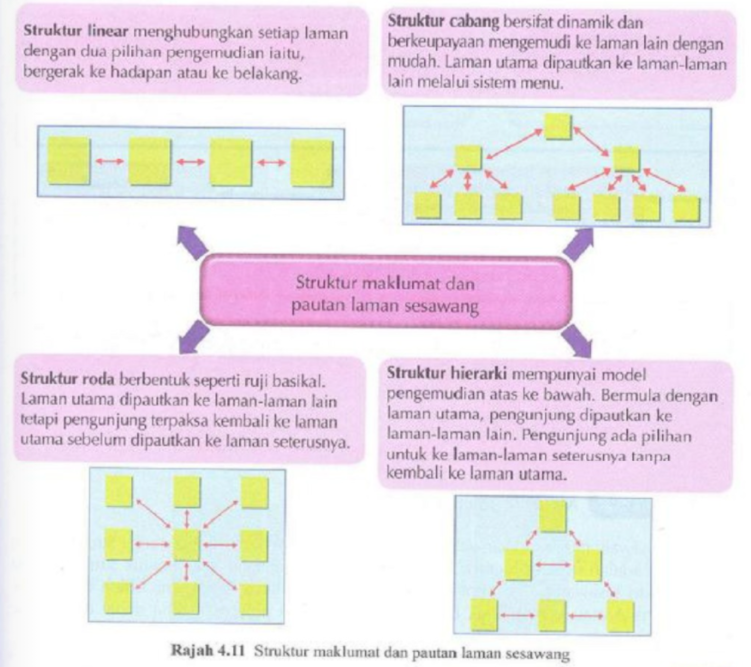

---

#### Tag dalam HTML
    <html></html>
Tag ini memaklumkan **permulaan fail HTML**.

    <head></head>
Tag ini adalah **bahagian kepala atur cara HTML**.

    <title></title>
Tag ini **memaparkan tajuk laman web**.

    <body></body>
Tag ini adalah **bahagian kandungan fail HTML**, iaitu kandungan dokumen seperti **teks**, **imej**, **pautan** dan sebagainya.

---

#### _Paragraph headings_ dalam HTML
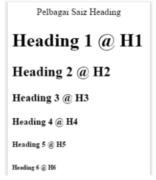

    <h1></h1>
    <h2></h2>
    <h3></h3>
    <h4></h4>
    <h5></h5>
    <h6></h6>
Tag `<h1>` akan memaparkan **saiz teks terbesar** manakala `<h6>` memaparkan **saiz teks terkecil**.

---

#### _Banner_, _frame_ dan _menu_ dalam HTML
Berikut menerangkan bahagian **_banner_**, **_menu_** dan **_frame_** dalam laman sesawang Kementerian Pendidikan Malaysia (KPM).
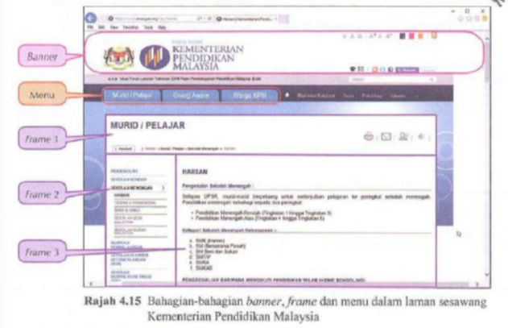
- **_Banner_** boleh dibina mengikut langkah berikut:
    1. Muat turun logo yang diinginkan
    2. Simpan file dalam bentuk `logo.jpg`
    3. Taipkan kod arahan asas HTML
    4. Taipkan banner dalam tag `<title></title>`
    5. Taipkan `<banner></banner>` dalam tag `<body></body>`
    6. Taipkan kod arahan `` ke dalam `<banner></banner>`.
    7. Klik **File > Save As** dan pilih folder HTML serta tukar nama dokumen kepada `banner.html` dan **Save**.

**_Frame_** terdiri daripada **ruang melintang dan ruang menegak atau gabungan kedua-duanya**.
    - Bagi _frame_ melintang, atribut `rows` akan digunakan dalam tag `<frameset>`. Contohnya:
    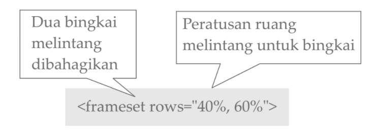
    - Bagi _frame_ menegak, tag `cols` digunakan dalam tag `<frameset>`. Contohnya:
    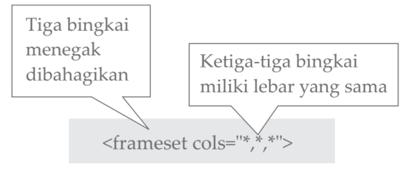
    
**_Menu_** menggunakan _tags_ seperti:
- `<nav></nav>` mentakrif pautan laman web *(navigation bar)*
- `<ul></ul>` mentakrif senarai tak tertib *(unordered list)*
- `<li></li>` mentakrif item dalam senarai *(list item)*

Menu boleh dibina mengikut langkah berikut:
1. Taipkan kod arahan asas HTML
2. Taipkan `menu1` dalam tag `<title></title>` dan klik **File>Save As** `Menu1.html`
3. Tukar `Menu1` kepada `Menu2` dan simpan sebagai `Menu2.html`.
4. Ulang langkah 2 dan 3 untuk hasilkan `Menu3.html` dan `Menu4.html`.
5. Buka file baharu dan tuliskan kod arahan di bawah:
    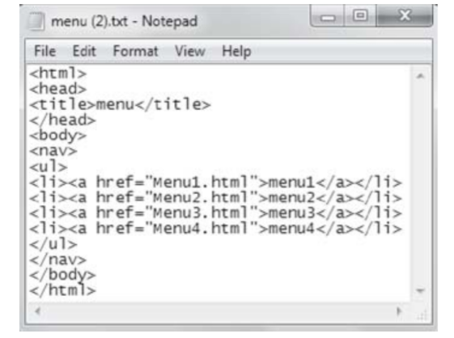
6. Klik **File > Save As** dan pilih folder HTML serta tukar nama dokumen kepada `menu.html` dan **Save**.

---

#### Pautan teks _(hyperlink)_ dan imej dalam HTML
Pautan teks dan imej bertindak sebagai **navigasi dalam laman sesawang** yang sama atau beberapa laman sesawang dalam tapak sesawang yang sama atau berlainan.

Langkah-langkah membina pautan teks dalam HTML adalah seperti berikut:
1. Taipkan kod arahan asas HTML
2. Taipkan kod seperti berikut:
    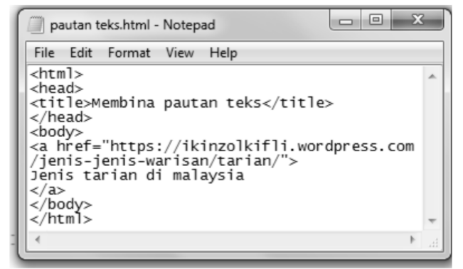
3. Klik **File > Save As** untuk menyimpan dokumen sebagai fail HTML.

Langkah-langkah membina pautan imej dalam HTML adalah seperti berikut:
1. Taipkan kod arahan asas HTML
2. Taipkan kod seperti berikut
    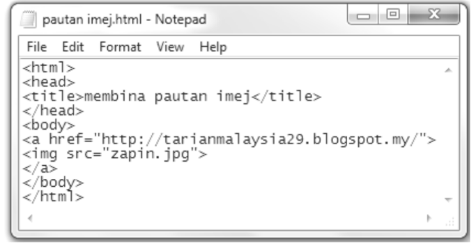
3. Klik **File > Save As** untuk menyimpan dokumen sebagai fail HTML.

---

#### Memasukkan Imej dalam HTML
Langkah-langkah memasukkan imej dalam HTML adalah seperti berikut:
1. Taipkan kod arahan asas HTML
2. Pilih satu imej dan namakan sebagai `imej.jpeg`
3. Taipkan kod seperti di bawah:
    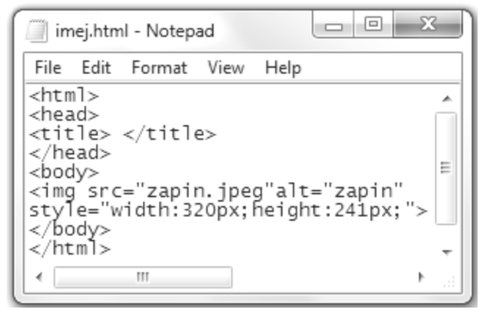
4. Klik **File > Save As** untuk menyimpan dokumen sebagai fail HTML.

---

#### _Pull-down menu_ dalam HTML
**Pull-down menu** turut dikenali sebagai ***drop-down menu***, ***drop-down list*** dan ***drop-down box***.

Tags yang terlibat dalam membina pull-down menu ialah:
- `<select></select>` digunakan untuk menghasilkan *pull-down menu*
- `<option></option>` dimasukkan dalam tag `<select>` untuk menunjukkan jenis pilihan yang ada.

*Pull-down menu* boleh dibina mengikut langkah berikut:
1. Taipkan kod arahan asas HTML.
2. Masukkan tag `<select></select>` dalam tag `<body></body>`.
3. Taipkan kod seperti di bawah:
    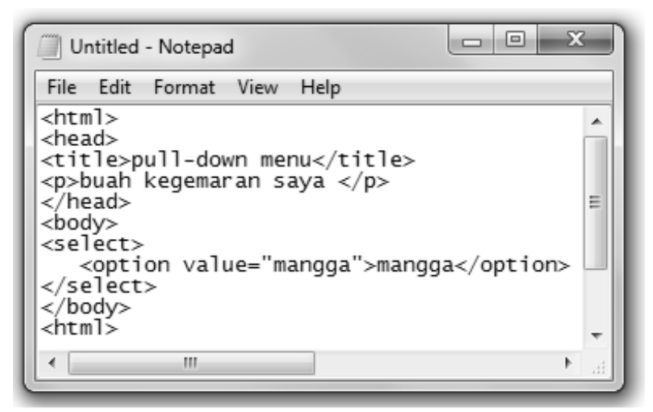
4. Ulangi tag `<option></option>` untuk 5 jenis buah yang lain seperti ditunjukkan di bawah:
    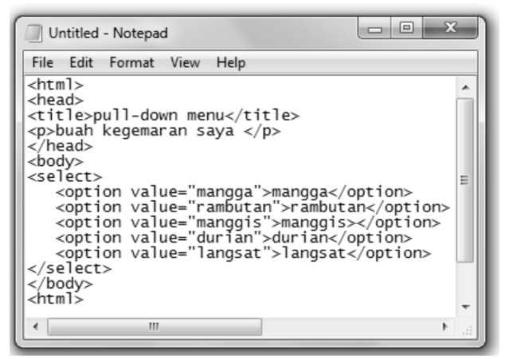
5. Klik **File > Save As** untuk menyimpan dokumen sebagai fail HTML.

---

#### Ruang Komen dalam HTML
- Ruang komen bertujuan untuk membolehkan pengunjung memberi maklum balas.
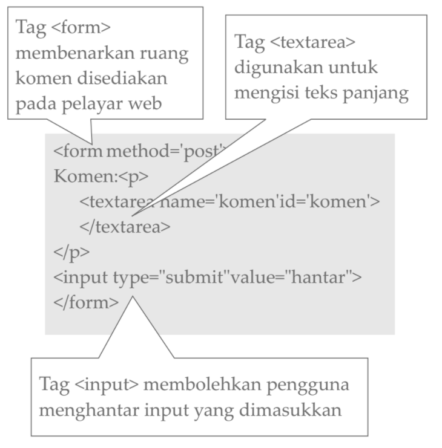

---

#### Mengesan Ralat
Langkah-langkah untuk mengesan ralat pada atur cara ialah:
- **Uji-lari _(Test run)_** atur cara yang dibina
- **Bandingkan** laman sesawang yang dipaparkan oleh pelayar web dengan apa yang dijangkakan 
- Kenal pasti ralat
- **Teliti-semula _(Check back)_** kod-kod HTML
- **Baiki Ralat** pada atur cara HTML

---

#### Membina Laman Sesawang yang Interaktif
Ringkasan langkah-langkah untuk membina laman sesawang interaktif ialah:
1. Pilih topik dan tajuk laman sesawang
2. Kumpulkan maklumat-maklumat
3. Lancarkan perisian aplikasi Notepad
4. Layari laman sesawang yang telah dibina
5. Baiki ralat (sekiranya ada)
6. Layari Internet
7. Muat naik fail
8. Lawat tapak sesawang yang telah siap dibina 


